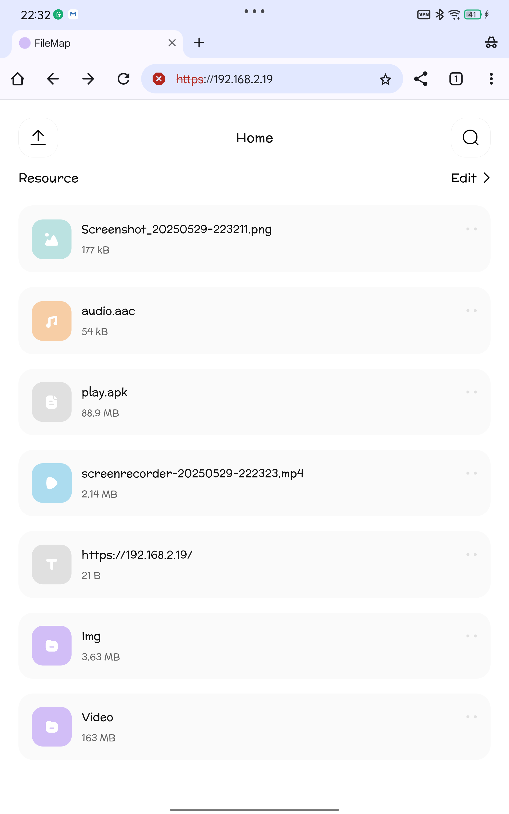

[English](README.en.md) | [简体中文](README.md)

# FileMap

FileMap is a LAN-based cross-device file sharing and management tool that enables seamless file, text, and image uploads and access across different devices.

---

## Features

- **Cross-Device and Cross-Platform Access**  
  Any device connected to the same LAN can access FileMap via a browser, enabling quick sharing of files, text, and images.

- **Support for Multiple File Types**  
  - Desktop: Supports direct pasting of text or files.  
  - Mobile: Allows quick text pasting in the navigation bar's central area.  
  - Other file types can be submitted conveniently via an upload form.

- **Flexible Directory Management**  
  Supports creating new directories and moving directories, making it easy to organize folder hierarchies and manage categories.

- **Batch Operations**  
  Supports batch downloading and batch deletion to improve daily operation efficiency.

- **Free File and Directory Movement**  
  Files and folders can be freely moved between directories, allowing flexible storage structure adjustments.

---

## Preview



---

## Running with Docker

```bash
make cert                               # Generate local certificate (Optional)
cd your_project_dir                     # Navigate to project directory
docker load -i file-map.tar             # Load Docker image
docker compose up -d                    # Start service in the background
```

Other commands:

```bash
docker compose restart                  # Restart service
docker compose down                     # Stop service
```