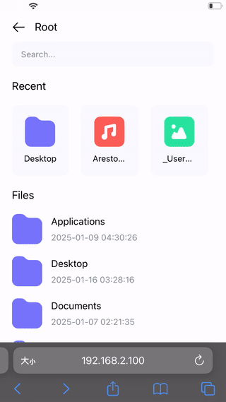

# FileMap

**FileMap** is a lightweight file mapping tool that allows you to map local files to a browser for previewing media files (audio, video, images) or downloading files within a LAN.

---

## Features

- **Easy Mapping**: Quickly share local files with devices in the same LAN.
- **Multi-format Support**: Preview audio, video, images, and download files.
- **Cross-platform**: Compatible with both Windows and macOS.

---

## Preview



---

## Getting Started

### 1. Pull Docker Image

#### Windows/MacOS Intel
```bash
docker pull anosaa/file-map-amd64:0.0.2
```

#### MacOS Apple Silicon
Please follow the build guide to compile the image for Apple Silicon.

### 2. Start the Container

Run the following command to start `FileMap`:

```bash
docker run -d --name file-map-server --restart=always \  
  -e GIN_MODE=release \  
  -p 9001:9001 \  
  -v <your log dir>:/log \              # Path for log files  
  -v <your root dir>:/mnt \             # Mapped directory accessible by the container  
  file-map-server:linux-amd64 \         # Choose the image based on the operating system
  -root <your root dir>                 # Root directory to be mapped  
  -password <your password> \           # Access password  
```

### Example
Windows
```bash
docker run -d --name file-map-server --restart=always `
  -e GIN_MODE=release `
  -p 9001:9001 `
  -v C:\Users\f\log:/log `
  -v C:\Users\f:/mnt `
  anosaa/file-map-amd64:0.0.2 `
  -root C:\Users\f `
  -password 1234
```

MacOS
```bash
docker run -d --name file-map-server --restart=always \
  -e GIN_MODE=release \
  -p 9001:9001 \
  -v /Users/f/Downloads/log:/log \
  -v /Users/f/Downloads:/mnt \
  anosaa/file-map-amd64:0.0.2 \
  -root /Users/f/Downloads \
  -password 1234
```

## Build Locally

### 1. Clone the Repository
```bash
git clone https://github.com/kuroill/file-map-server.git
```

### 2. Configure Development Environment
Modify `ROOT_DIR` in the `Makefile` based on your OS:

- **Windows**: Uncomment the second line and comment the first line:
  ```makefile
  # ROOT_DIR=/
  ROOT_DIR=C:  
  ```

- **MacOS**: Keep the default configuration:
  ```makefile
  ROOT_DIR=/
  # ROOT_DIR=C:  
  ```

### 3. Run the Service
```bash
make run
```

### 4. Build the Image
```bash
make build
```

---

## FAQ

1. **How can I access FileMap?**
   After starting the container, access `http://<host_ip>:9001` in your browser and enter the password.

2. **How can I change the mapped directory?**
   Update the `-root` parameter with the target directory and restart the container.

3. **Where are the log files stored?**
   Logs are saved in the directory specified by `-v <your log dir>`.
