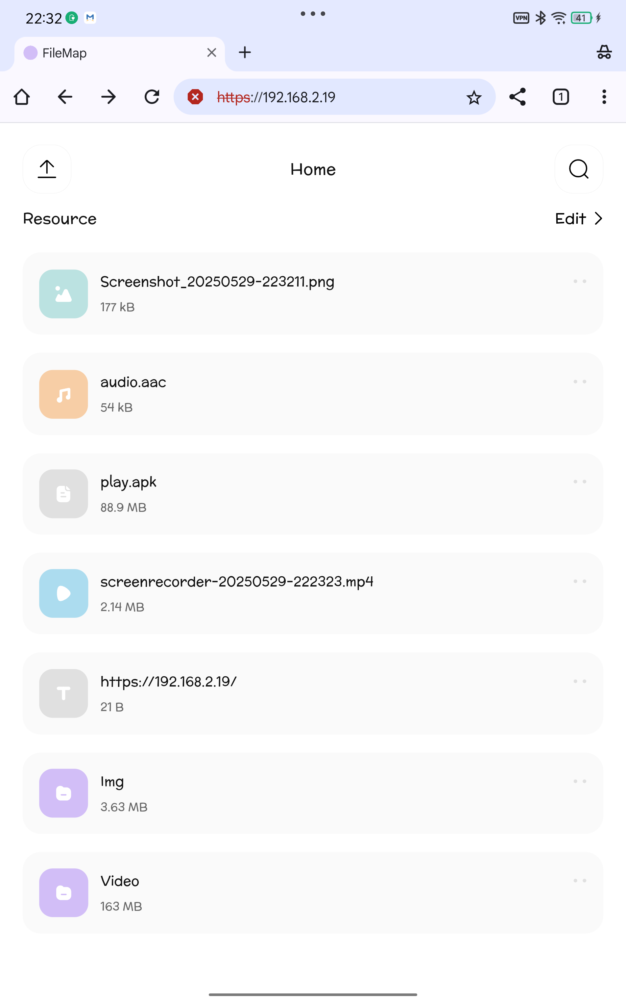

[English](README.en.md) | [简体中文](README.md)

# FileMap

FileMap 是一款基于局域网的跨设备文件共享与管理工具，实现了不同设备间文件、文本、图片的便捷上传与访问

---

## 功能

- **跨设备跨平台访问**  
  任何连接同一局域网的设备均可通过浏览器访问 FileMap，实现文件、文本、图片的快速共享

- **多类型文件上传支持**  
  - 桌面端支持直接粘贴文本或文件  
  - 移动端支持导航栏中心区域快速粘贴文本  
  - 其他文件类型通过上传表单便捷提交

- **灵活目录管理**  
  支持新建目录、目录移动，轻松整理文件夹层级，实现分类管理

- **批量操作**  
  支持批量下载、批量删除，提升日常操作效率

- **文件与目录自由移动**  
  文件和文件夹可在不同目录间自由移动，便于调整存储结构

---

## 预览



---

## 使用 Docker 运行

```bash
make cert                               # 生成本地证书（可选）
cd your_project_dir                     # 进入项目目录
docker load -i file-map.tar             # 加载 Docker 镜像
docker compose up -d                    # 后台启动服务
```

其他命令

```bash
docker compose restart                  # 重启服务
docker compose down                     # 停止服务
```